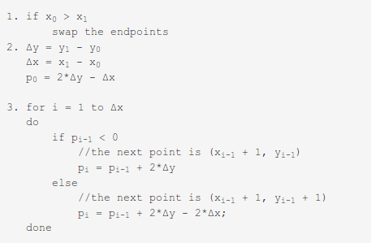

**Bresenham's Line Rasterization Algorithm**
Bresenham's algorithm is a very popular algorithm due to its simplicity and speed. It helps to avoid floating point calculations, which was particulary useful in the days when floating point operations could not be handled by the computers.

**Pseudo Code of the algorithm**

Input : Two Endpoints of the line, (x0, y0) & (x1, y1)
Assumption : For the description of the algorithm below, we have assumed the slope of the line(m) to have the constraint, 0 < m < 1. However the experiment works with any given line.

**Steps of the Algorithm**

